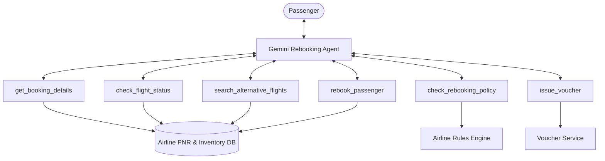

# Problem Statement: Airline Rebooking Agent

> **Source Link**: [Gemini Conversation (Session e4e2587d67a75ffa)](https://gemini.google.com/app/e4e2587d67a75ffa?hl=en-IN)

---

## 1. Original Prompt / Question
*(Note: Because direct access to private Gemini chat sessions requires browser authentication, paste the exact question or prompt from your Gemini session below if it differs from the specification.)*

```markdown
[PASTE EXACT PROMPT FROM GEMINI SESSION HERE]
```

---

## 2. Core Problem Definition
In airline operations, unexpected disruptions—known as **Irregular Operations (IROPs)**—such as severe weather, mechanical issues, air traffic control ground stops, and crew timeouts lead to delayed, diverted, or cancelled flights.

When disruptions occur, airlines face a massive surge in affected passengers needing immediate rebooking. Traditional call centers and customer service counters become overwhelmed, leading to hours of waiting and high customer dissatisfaction.

### Objective
Design and implement an autonomous, conversational **Airline Rebooking AI Agent** powered by the **Google Gemini API** capable of:
1. **Passenger Identification & Itinerary Retrieval**: Identifying the passenger and inspecting disrupted flight bookings (PNR).
2. **Policy-Compliant Flight Search**: Searching available alternative flights within allowable rebooking windows and fare/cabin rules.
3. **Disruption Reason & Policy Validation**: Determining eligibility for complimentary rebooking, refunds, meal/hotel vouchers, or priority handling based on loyalty status.
4. **Intelligent Alternative Recommendation**: Scoring and proposing the best alternatives tailored to passenger preferences (e.g., earliest arrival, nonstop flights, seat class, baggage transferability).
5. **Confirmation & Booking Modification**: Executing transactional rebooking, updating PNR, releasing previous seats, and issuing new boarding passes.
6. **Multi-Turn Interaction**: Handling human-in-the-loop negotiations, preference changes, and edge cases gracefully.

---

## 3. Functional Requirements

### 3.1 Flight & PNR Management
- **PNR Lookup**: Fetch passenger details, original itinerary, baggage count, and loyalty tier (e.g., Regular, Silver, Gold, Platinum).
- **Disruption Status Check**: Check if the flight is delayed (> 120 mins), cancelled, or missed connection due to airline fault.
- **Alternative Flight Discovery**: Query available airline inventory between origin and destination with real-time seat availability.

### 3.2 Rebooking Policies & Rules
- **Free Rebooking Window**: Passengers on cancelled or severely delayed flights can rebook to any flight within -1 to +3 days at zero fare difference.
- **Loyalty Priority**:
  - *Platinum / Gold*: Priority access to standby, complimentary upgrade if economy is full and business is available, free lounge/hotel vouchers.
  - *Silver / Regular*: Standard rebooking in original cabin class.
- **Direct vs. Connecting Flights**: Prefer direct flights; if unavailable, suggest connections with minimum 45 minutes and maximum 4 hours layover.

### 3.3 Transactional Safety & Guardrails
- **Confirmation Gate**: The agent must NEVER finalize a rebooking without explicit passenger consent.
- **Seat & Baggage Integrity**: Retain checked luggage tracking and attempt to match prior seat preferences (window/aisle).
- **Hallucination Prevention**: All flight numbers, times, gates, and seat assignments must come directly from tool outputs, not LLM imagination.

---

## 4. Agent Architecture & Tools



### Required Tool Interfaces
1. `get_booking_details(pnr: str, last_name: str) -> BookingInfo`
2. `search_flights(origin: str, destination: str, date: str) -> List[FlightOption]`
3. `rebook_passenger(pnr: str, new_flight_id: str, seat_preference: str) -> RebookingConfirmation`
4. `issue_amenity_voucher(pnr: str, voucher_type: str) -> VoucherDetails`
5. `escalate_to_human(pnr: str, reason: str) -> EscalationTicket`

---

## 5. Success Metrics
- **Resolution Rate**: Percentage of disrupted passengers successfully rebooked without human agent intervention.
- **Tool Precision**: Zero hallucinated flight numbers or invalid dates.
- **Policy Adherence**: 100% compliance with fare class rules, change fee waivers, and voucher distribution limits.
- **Latency & Turn Count**: Completing a rebooking in fewer than 4-5 conversational turns with sub-2-second model responses.
